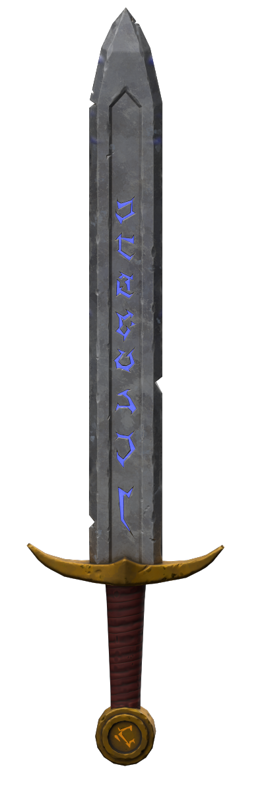
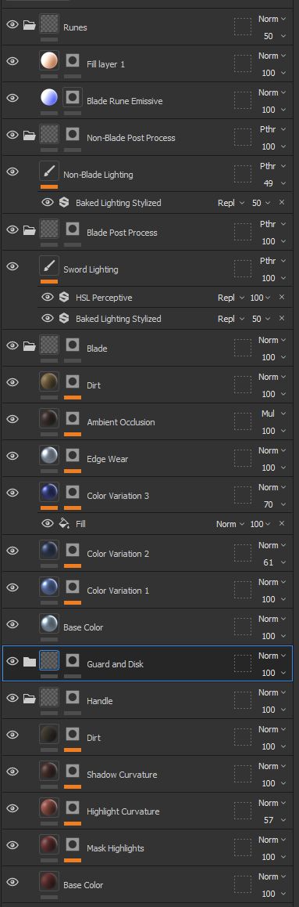
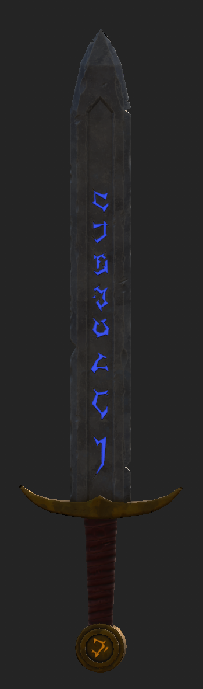
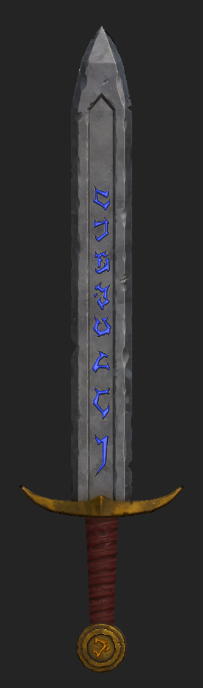
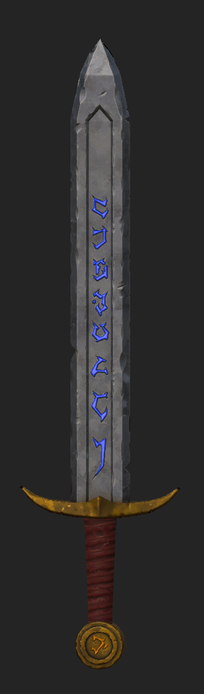

# Coursework for "Substance Painter - Rune Sword"

This contains the work created when completing the course [Substance Painter - Rune Sword](https://www.udemy.com/course/substance-painter-rune-sword/).

The course took the high poly and low poly meshes created in the
[Blender Sculpting - Rune Sword](https://www.udemy.com/course/blender-sculpting-rune-sword/) course and
generated textures for the sword and prepared assets for import into a game engine. Unfortunately several
problems were identified in the original meshes and several changes were made to improve the model for
the texturing process. The most significant changes involved modifying the UV mapping to eliminate unnecessary
seams/UV islands and ensuring that the dimensions of the high-poly and low-poly had fewer variations.

The texturing involved the following process:

* Create a separate folder for the "Blade", the "Handle" and the "Guard+Pommel"
* Create a separate (black) mask for each folder using `Mesh Fill` to restrict the UV islands that each folder is applied to the appropriate part of the mesh.
* Create a "Base Color" `Fill Layer` for each part.
* For the "Blade" and "Guard+Pommel" parts, create several "Color Variation" layers with different (black) masks to texture. These variations also changed the roughness and metallic channels
* For the "Blade" and "Guard+Pommel" parts, create an "Edge Wear" and "Ambient Occlusion" layer to add depth. The "Edge Wear" layer used a "Metal Edge Wear" generator in mask stack.
* The "Handle" part involved several layers with masks that restricted the layers applicability based on curvature.
* Add a "Dirt" layer for every part which involved a `Dirt` generator in the mask and a base color in fill. This layer also modified the metallic channel and roughness channels.
* Post-processing folders were added for the "Blade" and "Non-Blade" parts that added stylized lighting. The post-processing folders and layers needed to be marked as pass-through.
* An additional post-processing layer was added to the "Blade" to desaturate the sword and make it more sword-like.
* The final step was to add emissive layers for the runes. This involved adding an emissive channel to the texture set.
* The (black) masks for the runes needed a paint layer as there is no geometry in the low-poly model to represent the runes. This was the only paint layer present in the project.
* The emissive layers were fill layers that specified the emissive channel and the height channel to give the appears of glow.

<table width="100%">
<tbody>
<tr>
<td colspan="2">
<figure>
<figcaption>The final render</figcaption>

</figure>
</td>
<td>
<figure>
<figcaption>The layer stack of the project</figcaption>

</figure>
</td>
</tr>
<tr>
<td>
<figure>
<figcaption>A low resolution render in low light</figcaption>

</figure>
</td>
<td>
<figure>
<figcaption>A low resolution render in indirect light</figcaption>

</figure>
</td>
<td>
<figure>
<figcaption>A low resolution render in side lighting</figcaption>

</figure>
</td>
</tr>
</tbody>
</table>
